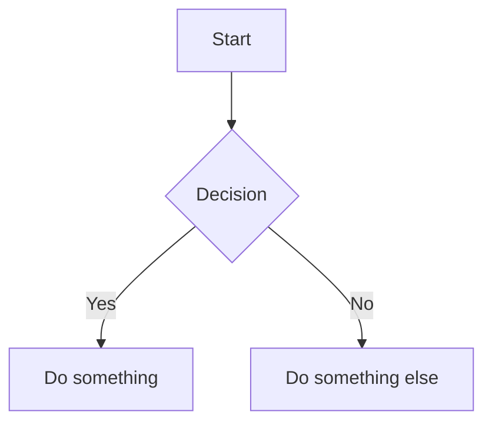

# NeuroFlow Notes - Roadmap

## In Progress

## Planned Features

### Property System
- [ ] **Property autocomplete** - Suggest existing property keys when typing
- [ ] **Property type validation** - Validate values based on property type (date, number, etc.)
- [ ] **Property templates** - Pre-defined property sets for different note types

### Task Management (GTD-style)
- [ ] **GTD annotations** - Support for contexts (`@home`, `@work`), priorities, due dates
- [ ] **Task rollover** - Auto-copy incomplete tasks to next daily page
- [ ] **Task inbox** - Collect tasks from all notes in one view
- [ ] **Task filtering** - Filter by context, project, due date, priority
- [ ] **Recurring tasks** - Tasks that regenerate on completion

### Daily Notes
- [ ] **Day summary** - AI-powered summary of the day's notes and completed tasks
- [ ] **Daily template** - Customizable template for new daily notes
- [ ] **Weekly/Monthly reviews** - Aggregate views of tasks and notes

### UI Improvements
- [ ] **Resizable panes** - Drag to resize sidebar, calendar, and editor panels
- [ ] **Collapsible sections** - Collapse/expand in folder tree and note sections
- [ ] **Tab support** - Multiple notes open in tabs

### Editor Enhancements
- [ ] **Mermaid diagrams** - Render mermaid code blocks as diagrams
- [ ] **Math support** - LaTeX/KaTeX rendering for equations
- [ ] **Table editor** - Visual table editing with tab navigation
- [ ] **Image paste** - Paste images from clipboard directly into notes

### Vim Mode (Partially Implemented)
- [x] Basic vim keybindings via @replit/codemirror-vim
- [ ] **Custom vim commands** - `:w` to save, `:q` to close, etc.
- [ ] **Vim status line** - Show current mode (NORMAL, INSERT, VISUAL)
- [ ] **Leader key mappings** - Customizable leader key shortcuts

## Completed
- [x] Markdown editor with CodeMirror 6
- [x] Wiki-style links with autocomplete
- [x] Tag support
- [x] Full-text search
- [x] Calendar views (monthly, weekly, daily)
- [x] Schedule blocks with recurrence (RRULE)
- [x] Link schedule blocks to existing notes
- [x] Folder tree with drag & drop
- [x] Media viewer (images, audio, video)
- [x] Properties panel
- [x] Backlinks tracking
- [x] Basic todo extraction from checkboxes
- [x] Theme support (Catppuccin)
- [x] Basic vim mode toggle

## Technical Debt
- [ ] Add comprehensive test coverage
- [ ] Performance optimization for large vaults
- [ ] Offline-first sync preparation
- [ ] Plugin architecture design

---

## Feature Details

### GTD Task Annotations

Proposed syntax for GTD-style task management:

```markdown
- [ ] Call mom @phone #family ^2024-12-15 !high
      ↑         ↑      ↑       ↑           ↑
      task   context  tag   due date   priority
```

Contexts: `@home`, `@work`, `@phone`, `@computer`, `@errands`
Priorities: `!high`, `!medium`, `!low`
Due dates: `^YYYY-MM-DD` or `^today`, `^tomorrow`, `^next-week`

### Task Rollover

When opening today's daily note:
1. Check yesterday's note for incomplete tasks
2. Prompt user: "You have 3 incomplete tasks from yesterday. Roll over?"
3. Copy selected tasks to today's note
4. Optionally mark original tasks as "rolled over"

### Day Summary

End-of-day summary could include:
- Tasks completed today
- Notes created/modified
- Time spent in schedule blocks
- AI-generated summary of key points

### Mermaid Support

Render mermaid code blocks as diagrams:



Would render as an interactive diagram in the editor.
